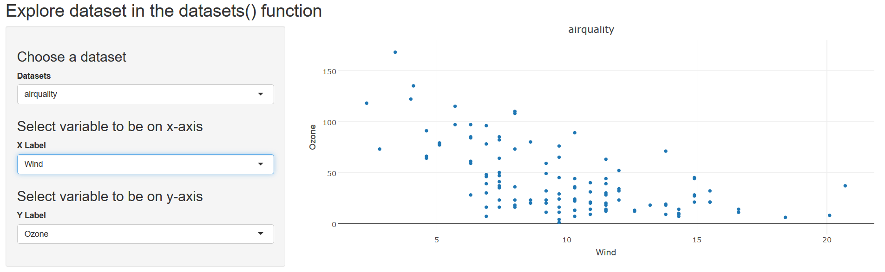

<style>
.title-slide {
  background-color: #FFFFFF; /* #EDE0CF; ; #CA9F9D*/
}
</style>
<!-- Limit image width and height -->
<style type='text/css'>
img {
    max-height: 560px;
    max-width: 964px;
}
</style>


## Introduction - Explore Datasets
This application makes the exploration of the built in datasets in the R base datasets package an easy an enyojable task. You don't need to load the data or even plot it. Everthing is made for you and all you have to do is to chose a dataset and what to plot on the x- and y-axis respectively.


Three steps is all it takes:

1. Chose dataset
2. Chose what to be on the x-axis
3. Chose what to be on the y-axis

--- .class #id 

## Example mtcarts - Explore Dataset
To show some example from the "Explore Datasets" application below the "mtcars" dataset is used to plot disp against mpg


---

## Example airquality - Explore Dataset
To show some example from the "Explore Datasets" application below the "airquality" dataset is used to plot Ozone against Wind





---

## Data processing / Calculations - Explore Datasets
All the datasets in the Datasets package are not dataframes. Since this is the case all dataset that aren't data frames are removed prior to creating the application. 60 of the 104 datasets are therefore removed. The code for this operation is shown below:

```{r}
datalist <- ls("package:datasets")
DLindex <- rep(FALSE,length(datalist))
for(i in 1:length(datalist)){
        if(is.data.frame(eval(parse(text = datalist[i]))) == TRUE){
                DLindex[i] <- TRUE
        }
}
datalist <- datalist[DLindex]
c(length(ls("package:datasets")),length(datalist))
```


